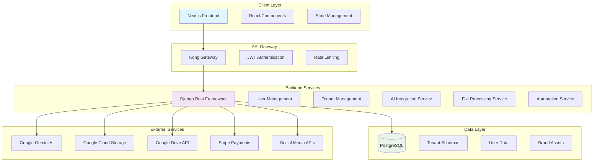

# AI Brand Automator MVP Architecture Plan

## 1. Project Overview

**Project Name:** AI Brand Automator (Enterprise SaaS)  
**Version:** MVP 1.0  
**Tech Stack:** Next.js / React.js (Frontend), Django Rest Framework (Backend), Kong Gateway, PostgreSQL (Multi-tenant), Google Cloud Storage & Drive API, Stripe API

## 2. MVP Scope Definition

Based on PRD priorities, the MVP will focus on high-priority features that deliver core value:

### Core User Journey
1. **Landing & Authentication** - LinkedIn-style sign-up/sign-in
2. **Onboarding** - Multi-step company profile setup with asset uploads
3. **AI Exploration** - Chatbot for brand strategy and file search
4. **Subscription** - Stripe payment for feature unlock
5. **Automation** - Basic social media profile creation and content scheduling

### High Priority Features (MVP)
- ✅ Multi-tenancy with data isolation
- ✅ JWT authentication via Kong Gateway
- ✅ AI chatbot with market analysis
- ✅ Multi-modal file uploads (text, images, videos)
- ✅ Stripe subscription tiers
- ✅ Social media profile automation
- ✅ Content calendar with scheduling
- ✅ Google Business Profile creation

### Medium Priority (Post-MVP)
- Team member invites
- Advanced AI features (video editing, thought leadership articles)
- E-commerce integrations
- Billing portal enhancements

## 3. System Architecture



### Architecture Components

#### Frontend (Next.js)
- **Landing Page:** Marketing site with sign-up/sign-in
- **Dashboard:** Post-login user interface
- **Onboarding Flow:** Multi-step wizard
- **AI Chat Interface:** Gemini-powered chatbot
- **File Upload:** Drag-and-drop interface
- **Subscription Management:** Stripe integration

#### Backend (Django DRF)
- **Authentication:** JWT token management
- **Multi-tenancy:** Schema-based isolation
- **API Endpoints:** RESTful APIs for all features
- **Background Tasks:** Celery for async processing
- **File Handling:** Google Cloud Storage integration

#### Infrastructure
- **Kong Gateway:** API management and security
- **PostgreSQL:** Multi-tenant database
- **Redis:** Caching and task queue
- **Google Cloud:** Storage and AI services
- **Stripe:** Payment processing

## 4. Database Schema Design

### Multi-Tenant Architecture
Using schema-based multi-tenancy for data isolation:

```sql
-- Public schema (shared)
CREATE SCHEMA public;

-- Tenant-specific schemas
CREATE SCHEMA tenant_123;
CREATE SCHEMA tenant_456;

-- Switch to tenant schema
SET search_path TO tenant_123;
```

### Core Tables

#### User Management
```sql
-- public.tenants
CREATE TABLE tenants (
    id UUID PRIMARY KEY,
    name VARCHAR(255) NOT NULL,
    domain VARCHAR(255) UNIQUE,
    subscription_status VARCHAR(50),
    stripe_customer_id VARCHAR(255),
    created_at TIMESTAMP DEFAULT NOW()
);

-- tenant_schema.users
CREATE TABLE users (
    id UUID PRIMARY KEY,
    tenant_id UUID REFERENCES public.tenants(id),
    email VARCHAR(255) UNIQUE NOT NULL,
    role VARCHAR(50) DEFAULT 'admin', -- admin, editor, viewer
    is_active BOOLEAN DEFAULT TRUE,
    created_at TIMESTAMP DEFAULT NOW()
);

-- tenant_schema.user_profiles
CREATE TABLE user_profiles (
    id UUID PRIMARY KEY,
    user_id UUID REFERENCES users(id),
    first_name VARCHAR(100),
    last_name VARCHAR(100),
    avatar_url VARCHAR(500)
);
```

#### Brand Data
```sql
-- tenant_schema.companies
CREATE TABLE companies (
    id UUID PRIMARY KEY,
    name VARCHAR(255) NOT NULL,
    description TEXT,
    industry VARCHAR(100),
    target_audience TEXT,
    core_problem TEXT,
    brand_voice VARCHAR(50),
    vision_statement TEXT,
    mission_statement TEXT,
    values JSONB, -- Array of value objects
    positioning_statement TEXT,
    created_at TIMESTAMP DEFAULT NOW(),
    updated_at TIMESTAMP DEFAULT NOW()
);

-- tenant_schema.brand_assets
CREATE TABLE brand_assets (
    id UUID PRIMARY KEY,
    company_id UUID REFERENCES companies(id),
    file_name VARCHAR(255),
    file_type VARCHAR(50), -- image, video, document
    gcs_path VARCHAR(500), -- Google Cloud Storage path
    uploaded_at TIMESTAMP DEFAULT NOW()
);

-- tenant_schema.onboarding_progress
CREATE TABLE onboarding_progress (
    id UUID PRIMARY KEY,
    company_id UUID REFERENCES companies(id),
    current_step VARCHAR(50),
    completed_steps JSONB,
    is_completed BOOLEAN DEFAULT FALSE,
    last_updated TIMESTAMP DEFAULT NOW()
);
```

#### AI & Automation
```sql
-- tenant_schema.chat_sessions
CREATE TABLE chat_sessions (
    id UUID PRIMARY KEY,
    user_id UUID REFERENCES users(id),
    session_id VARCHAR(255),
    messages JSONB, -- Array of chat messages
    created_at TIMESTAMP DEFAULT NOW()
);

-- tenant_schema.automation_tasks
CREATE TABLE automation_tasks (
    id UUID PRIMARY KEY,
    company_id UUID REFERENCES companies(id),
    task_type VARCHAR(50), -- social_profile, content_schedule, etc.
    status VARCHAR(50) DEFAULT 'pending',
    scheduled_at TIMESTAMP,
    executed_at TIMESTAMP,
    result JSONB,
    created_at TIMESTAMP DEFAULT NOW()
);

-- tenant_schema.social_profiles
CREATE TABLE social_profiles (
    id UUID PRIMARY KEY,
    company_id UUID REFERENCES companies(id),
    platform VARCHAR(50), -- linkedin, instagram, facebook, twitter
    profile_url VARCHAR(500),
    is_verified BOOLEAN DEFAULT FALSE,
    created_at TIMESTAMP DEFAULT NOW()
);

-- tenant_schema.content_calendar
CREATE TABLE content_calendar (
    id UUID PRIMARY KEY,
    company_id UUID REFERENCES companies(id),
    title VARCHAR(255),
    content TEXT,
    platforms JSONB, -- Array of platforms
    scheduled_date TIMESTAMP,
    status VARCHAR(50) DEFAULT 'draft',
    created_at TIMESTAMP DEFAULT NOW()
);
```

## 5. API Design

### Authentication Endpoints
```
POST /api/v1/auth/login
POST /api/v1/auth/register
POST /api/v1/auth/refresh
POST /api/v1/auth/logout
```

### Tenant Management
```
GET /api/v1/tenants
POST /api/v1/tenants
GET /api/v1/tenants/{tenant_id}/users
POST /api/v1/tenants/{tenant_id}/users/invite
```

### Onboarding
```
GET /api/v1/onboarding/progress
PUT /api/v1/onboarding/progress
POST /api/v1/onboarding/company
PUT /api/v1/onboarding/company
POST /api/v1/onboarding/assets/upload
```

### AI Features
```
POST /api/v1/ai/chat
POST /api/v1/ai/generate-brand-strategy
POST /api/v1/ai/analyze-market
GET /api/v1/ai/search-files
```

### Automation
```
POST /api/v1/automation/create-social-profiles
POST /api/v1/automation/schedule-content
GET /api/v1/automation/tasks
POST /api/v1/automation/google-business-profile
```

### Payments
```
GET /api/v1/subscriptions/plans
POST /api/v1/subscriptions/create-session
GET /api/v1/subscriptions/status
POST /api/v1/subscriptions/webhook
```

## 6. Frontend Component Structure

### Page Structure
```
/ (Landing Page)
/auth/login
/auth/register
/dashboard
/onboarding
/onboarding/step-1 to /onboarding/step-5
/chat
/files
/automation
/subscription
/billing
```

### Key Components
- **Auth Components:** LoginForm, RegisterForm, SocialAuthButtons
- **Onboarding:** StepWizard, CompanyForm, AssetUploader
- **Dashboard:** OverviewCards, RecentActivity, QuickActions
- **AI Chat:** ChatInterface, MessageBubble, FileSearch
- **File Management:** UploadZone, FileGrid, PreviewModal
- **Automation:** SocialProfileSetup, ContentScheduler, CalendarView
- **Payments:** SubscriptionPlans, PaymentForm, BillingHistory

## 7. AI Integration Plan

### Gemini AI Integration
- **Brand Strategy Generation:** Vision, mission, values, positioning
- **Market Analysis:** Competitor analysis, positioning opportunities
- **Chatbot:** Natural language interaction for brand guidance
- **Content Generation:** Social media posts, thought leadership

### Implementation
```python
# services/ai_service.py
from google.generativeai import GenerativeModel

class AIService:
    def __init__(self):
        self.model = GenerativeModel('gemini-2.0-flash-exp')

    async def generate_brand_strategy(self, company_data: dict) -> dict:
        prompt = self._build_brand_prompt(company_data)
        response = await self.model.generate_content(prompt)
        return self._parse_brand_response(response)

    async def chat_with_brand_data(self, message: str, context: dict) -> str:
        prompt = self._build_chat_prompt(message, context)
        response = await self.model.generate_content(prompt)
        return response.text
```

## 8. File Storage & Processing

### Google Cloud Storage Integration
- **Bucket Structure:** `tenant-{tenant_id}/assets/`
- **File Types:** Images, videos, documents
- **Access Control:** Signed URLs for secure access
- **Metadata:** File type, size, upload date

### File Processing Pipeline
1. Upload to GCS
2. Extract metadata
3. Generate thumbnails (images)
4. Index for search (text files)
5. Store in database

## 9. Payment Integration (Stripe)

### Subscription Tiers
- **Basic:** $29/month - Core features, 1 brand
- **Pro:** $79/month - Advanced AI, 5 brands, automation
- **Enterprise:** $199/month - Unlimited, team features, priority support

### Webhook Handling
```python
# webhooks/stripe_webhooks.py
@csrf_exempt
def stripe_webhook(request):
    payload = request.body
    sig_header = request.META['HTTP_STRIPE_SIGNATURE']

    try:
        event = stripe.Webhook.construct_event(
            payload, sig_header, endpoint_secret
        )
    except ValueError:
        return HttpResponse(status=400)

    if event['type'] == 'invoice.payment_succeeded':
        handle_payment_success(event['data']['object'])
    elif event['type'] == 'customer.subscription.deleted':
        handle_subscription_cancelled(event['data']['object'])

    return HttpResponse(status=200)
```

## 10. Automation Features

### Social Media Automation
- **Profile Creation:** LinkedIn, Instagram, Facebook, Twitter
- **Content Scheduling:** Automated posting calendar
- **Google Business Profile:** Automated setup and verification

### Background Processing
```python
# tasks/automation.py
@shared_task
def create_social_profiles(tenant_id, company_data):
    # Create LinkedIn company page
    linkedin_api.create_company_page(company_data)

    # Create Instagram business account
    instagram_api.setup_business_account(company_data)

    # Update automation status
    AutomationTask.objects.filter(
        tenant_id=tenant_id,
        task_type='social_profile'
    ).update(status='completed')
```

## 11. Security & Compliance

### Data Isolation
- Schema-based multi-tenancy
- Row-level security policies
- Encrypted data at rest (PostgreSQL AES-256)

### API Security
- Kong Gateway rate limiting (100 req/min per user)
- JWT token validation
- CORS configuration
- Input sanitization

### File Security
- Signed URLs for GCS access
- File type validation
- Virus scanning (future enhancement)

## 12. Implementation Roadmap

### Phase 1: Foundation (2 weeks)
- [ ] Set up Django project with multi-tenancy
- [ ] Configure PostgreSQL with tenant schemas
- [ ] Implement basic authentication
- [ ] Create tenant and user models

### Phase 2: Core Backend (3 weeks)
- [ ] Build REST APIs for onboarding
- [ ] Integrate Google Cloud Storage
- [ ] Implement file upload/processing
- [ ] Add AI service integration

### Phase 3: Frontend Development (4 weeks)
- [ ] Create Next.js project structure
- [ ] Build authentication UI
- [ ] Implement onboarding flow
- [ ] Develop AI chat interface

### Phase 4: Integrations (2 weeks)
- [ ] Stripe payment integration
- [ ] Social media API connections
- [ ] Kong Gateway configuration
- [ ] Webhook handling

### Phase 5: Automation (3 weeks)
- [ ] Social profile creation
- [ ] Content scheduling system
- [ ] Background task processing
- [ ] Google Business Profile setup

### Phase 6: Testing & Deployment (2 weeks)
- [ ] Unit and integration tests
- [ ] End-to-end testing
- [ ] Docker containerization
- [ ] Production deployment

## 13. Success Metrics

### Technical Metrics
- API response time < 200ms
- 99.9% uptime
- Data isolation verified
- Security audit passed

### Business Metrics
- User onboarding completion rate > 80%
- Subscription conversion rate > 30%
- AI feature usage > 70% of users
- Customer satisfaction score > 4.5/5

## 14. Risks & Mitigations

### Technical Risks
- **AI API Limits:** Implement caching and rate limiting
- **Multi-tenancy Complexity:** Start with schema-based approach, monitor performance
- **File Processing:** Async processing with Celery, error handling

### Business Risks
- **Market Competition:** Focus on unique AI automation features
- **User Adoption:** Intuitive UX, comprehensive onboarding
- **Scalability:** Cloud-native architecture from day one

---

**Document Version:** 1.0  
**Last Updated:** January 9, 2026  
**Status:** Ready for Review